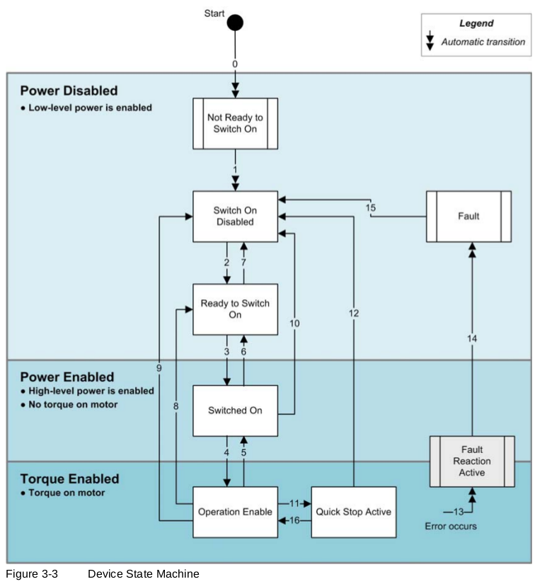

# MAXPOS driver

## Intro

This driver for orocos soem master compoennt allows to use connect via Ethercat with the maxon max-pos controller.
The way the controller works is specified in the [MAXPOS firmware specification manual](http://academy.maxonjapan.co.jp/wp-content/uploads/manual/maxpos/MAXPOS-Firmware-Specification-En.pdf).

For the moment I implemented the control modes that i need, the direct control modes.

- The Cyclic Syncronous **Position** Mode
- The Cyclic Syncronous **Velocity** Mode
- The Cyclic Syncronous **Torque** Mode
	
The other 3 modes
	
- Profile Position Mode,
- Homing Mode, and
- Profile Velocity Mode

Are not implemented, but can be easily done following the code.

At the moment, also the writing of digiral output is not possible, as there is the need to configure the Digital IO accordingly. Again this functionlaity can be added.

## Usage

We assume that the controller is correcly setup using the Maxon software, with tuning and all, that you access the ethercat slave *e.g.* with the `slaveinfo` program.

### internal state machine
The maxpos has a state machine, depicted in figure.


The state machine must be traversed in order to bring the controller ot the **operation enabled** state.
 To do so the following operations must be called:
```lua
fault_reset()
reset()
set_mode_of_operation(9) --velocity
switch_on()
enable_operation()
```
 
 The `set_mode_of_operation` must be called before motors are powered. The used values are the one used in the firmware, and are: 
 
- 1:   Profile Position Mode (PPM) - *not implemented *
- 3:   Profile Velocity Mode (PVM) - *not implemented *
- 6:   Homing Mode (HMM) - *not implemented*
- 8:   Cyclic Synchronous Position Mode (CSP)
- 9:   Cyclic Synchronous Velocity Mode (CSV)
- 10: Cyclic Synchronous Torque Mode (CST)

### Physical constants
There are two values (properties) to be set:
- `encoder_thick_per_revolution`
- `gear_ratio`
Another value, the `motor_rated_torque` is queried from the driver.
Please note that the driver comunicates in terms of percent of the *motor rated torque*. This is translated in _normal_ torque.

`motor_rated_torque` is shown as a constant in the component interface.

**Conversion Factors**

In the component there  3 values that are computed:
```c++
double pos_coversion_factor=((2*M_PI)/encoder_thick_per_revolution)/gear_ratio; //thick->radiants/sec (or other depending by the unit of the gear ratio)
double vel_coversion_factor=((2*M_PI)/60.0)/gear_ratio;
double tau_coversion_factor=(motor_rated_torque/1000.0)*gear_ratio;
```
The last factor **should be ok** but direct torque control has not be tested experimentally (I did not measure the output torque w.r.t. the commanded one). Please verify before attaching fragile parts to the motor shaft.

In case you know the efficiency of the transimission, you can modify the code to take it into account.

##Additional documentation
in the doc folder there is the results of the `slaveinfo` command, with the  `-sdo` and `-map` options. These files can be useful to add further functionalities.

## Acknoledgements
We coded using as example the soem_robotiq drivers.
